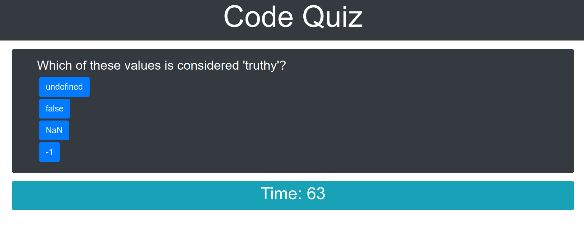

# Code Quiz
## Description
This repository contains a timed, interactive code quiz with a leader board.
It uses *Bootstrap* to achieve a minimalist style without the need for any CSS.
It uses *jQuery* to retrieve a JSON file containing the questions at runtime.
The UI is clean, polished and responsive to multiple screen sizes.
When the quiz starts, the user is presented with a question and multiple options.
After selecting an option, the user is presented with the next question.
If the user selects an incorrect option, time is deducted.
When the user completes the quiz, the total time remaining represents their score.
Scores are saved in local storage.
Scores are displayed on the leader board, sorted from highest to lowest.

## Usage
The deployed website can be viewed here: https://dandycodes.github.io/code-quiz/
## Credits
https://developer.mozilla.org/en-US/

https://www.w3schools.com/
## License
Copyright (c) DandyCodes. All rights reserved.

Licensed under the [MIT](LICENSE.txt) license.`
